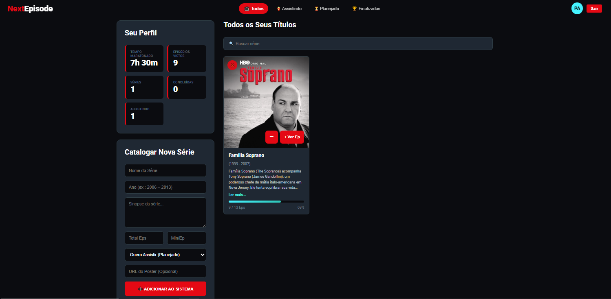

# 🎬 NextEpisode

Aplicação web para gerenciamento de séries desenvolvida com **Node.js**, **TypeScript**, **Express**, **MySQL** e **Docker**.

## 📸 Demonstração



## 🚀 Tecnologias

- Node.js
- TypeScript
- Express
- MySQL
- Docker
- Docker Compose

## 📁 Estrutura do projeto

```
NextEpisode/
├── docker/
├── public/
├── src/
├── Dockerfile
├── docker-compose.yml
├── package.json
└── README.md
```

## ▶️ Como executar

### Pré-requisitos

- Docker
- Docker Compose

### Executando

```bash
docker compose up --build
```

Depois, acesse:

```
http://localhost:3000
```

## ✨ Funcionalidades

- Cadastro de séries
- Atualização de episódios assistidos
- Remoção de séries
- Estatísticas de visualização
- API REST
- Persistência em MySQL

## 👨‍💻 Autor

Pedro Augusto